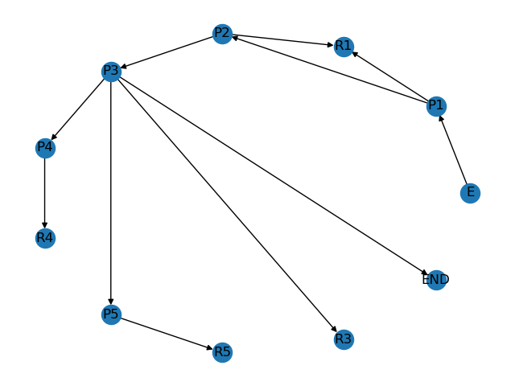

# Practica LP Alejandro Gonzalez

Bot de Telegram para contestar encuestas para la asignatura de LP de la FIB

## Ejecucion

Para ejecutar el código del compilador, ejecutar la siguiente instrucción en la consola.
```{shell}
python test.enquesta.py ../data/pregreg.txt
```
Este compilador, elige el fichero que se le pasa como primer argumento y genera un fichero modelado.p en la carpeta data y un grafo en forma de imagen en la carpeta img

Con el fichero de prueba del enunciado se genera el siguiente grafo:


Para ejecutar el bot de Telegram necesitamos el fichero modelado.p, ya que sin las estructura de la encuestas no sabrá que ha de mostrar.
El sistema puede obtener múltiples encuestas de un fichero a compilar.
El bot se ejecuta con el siguiente comando:

 
```{shell}
python bot.py 
```
Link al [bot](https://web.telegram.org/#/im?p=@AlejandroCompiletBot).


## Autor

* **Alejandro Gonzalez Garcia**

